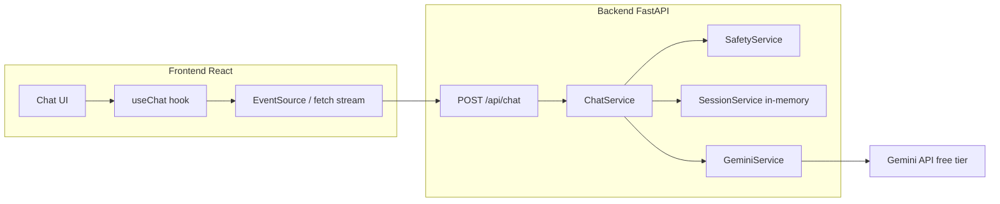
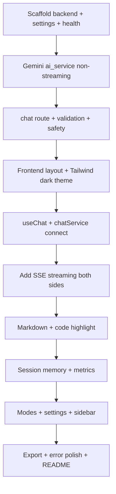

# Askio — Complete Implementation Plan

## Current State

| Area                                 | Status                                                                                        |
| ------------------------------------ | --------------------------------------------------------------------------------------------- |
| [frontend/](frontend/)               | Vite + React 19 default template only (no Tailwind, no chat UI)                               |
| [backend/](backend/)                 | Python venv with `fastapi`, `uvicorn`, `pydantic`, `google-genai` installed — **no app code** |
| [project_plan.txt](project_plan.txt) | Full 23-phase feature spec                                                                    |

Folders stay as `frontend/` and `backend/` (not `askio-client` / `askio-server`).

---

## Architecture Overview



**Request flow:** User message → validation → profanity/toxicity check → build minimal prompt (system + last N turns) → Gemini stream → SSE to frontend → markdown render.

**Security:** API key lives only in backend `.env`. Frontend never calls Gemini directly.

---

## Phased Delivery (Easy → Hard)

### Phase A — Foundation (build first, ~1–2 days)

Goal: End-to-end chat works locally (non-streaming OK initially, then SSE).

- Backend scaffold + health check + CORS
- `POST /api/chat` with Gemini integration via service layer
- Input validation + basic profanity filter
- Frontend dark chat layout (Header, MessageList, ChatInput)
- Connect frontend to backend with Axios/fetch
- Root + per-folder README stubs

### Phase B — Core UX (~2–3 days)

- SSE streaming (`StreamingResponse`)
- React Markdown + syntax highlighter + copy button on code blocks
- Loading phases: "Understanding…" → "Thinking…" → "Writing…"
- Friendly error messages (timeout, rate limit, validation)
- Auto-scroll, character counter, debounced input
- In-memory session memory (last N messages per browser session ID)

### Phase C — Smart Features (~2–3 days)

- Auto language detection (reply in user's language — no dropdown)
- Response modes dropdown (Simple / Detailed / Professional / Teacher / Programmer / Interviewer)
- Sidebar: New Chat, Clear Chat, Export TXT/MD
- Settings panel: theme toggle, temperature, max response length
- Metrics footer: latency, estimated tokens, word/char count

### Phase D — Advanced (hardest, later)

- Voice: Web Speech API STT + optional TTS playback
- Export PDF
- Virtualized message list (if chats get long)
- Code splitting / lazy-loaded Markdown highlighter
- Deploy: frontend (Vercel/Netlify) + backend (Render/Railway)

---

## Token Efficiency Strategy (Gemini Free Tier)

Free tier is quota-bound, so every design choice should minimize tokens:

| Rule                               | Implementation                                                                                              |
| ---------------------------------- | ----------------------------------------------------------------------------------------------------------- |
| Use a fast/cheap model             | Default `gemini-2.0-flash` (or `gemini-2.5-flash` if available on your key)                                 |
| One compact system prompt          | ~80–120 tokens max in [`backend/app/prompts/system.py`](backend/app/prompts/system.py)                      |
| Mode suffixes, not full prompts    | Each mode adds 1 short line in [`backend/app/prompts/modes.py`](backend/app/prompts/modes.py)               |
| Cap history                        | Send only last **6 turns** (12 messages) from session memory                                                |
| Cap output                         | `max_output_tokens` from settings (default 512 Simple, 1024 Detailed)                                       |
| Skip redundant text                | Strip extra whitespace; do not resend unchanged system prompt per turn if using Gemini cached content later |
| No token counting on every request | Estimate tokens locally (`len(text)//4`); call Gemini `count_tokens` only for metrics display optionally    |
| Block before AI                    | Safety filter runs locally — zero API tokens on blocked messages                                            |
| Streaming                          | Same token cost but better UX; no duplicate full-response calls                                             |

**Example compact system prompt (store in `system.py`):**

```python
BASE_SYSTEM = (
    "Askio assistant. Reply in the user's language. "
    "Use markdown for code/lists. Be concise unless mode says otherwise."
)
```

**Example mode suffix (`modes.py`):**

```python
MODES = {
    "simple": "Short answers.",
    "teacher": "Explain step-by-step simply.",
    "programmer": "Include code examples.",
}
```

---

## Backend — File Structure and Purpose

Every Python file starts with a module docstring:

```python
"""
Purpose: <one-line what this file does>
Usage: <who imports/calls it>
"""
```

### Root backend files

| File                                                   | Purpose                                                                                         |
| ------------------------------------------------------ | ----------------------------------------------------------------------------------------------- |
| [`backend/main.py`](backend/main.py)                   | FastAPI app entry: mount routers, middleware, lifespan                                          |
| [`backend/requirements.txt`](backend/requirements.txt) | Pinned deps: fastapi, uvicorn, pydantic-settings, google-genai, better-profanity, python-dotenv |
| [`backend/.env.example`](backend/.env.example)         | Template: `GEMINI_API_KEY`, `GEMINI_MODEL`, `CORS_ORIGINS`, `MAX_PROMPT_CHARS`                  |
| [`backend/.gitignore`](backend/.gitignore)             | Ignore `venv/`, `.env`, `__pycache__`                                                           |

### `backend/app/config/`

| File                                            | Purpose                                                                         |
| ----------------------------------------------- | ------------------------------------------------------------------------------- |
| [`settings.py`](backend/app/config/settings.py) | Pydantic `Settings` loaded from env; single source for model name, limits, CORS |

### `backend/app/api/`

| File                                     | Purpose                                                                           |
| ---------------------------------------- | --------------------------------------------------------------------------------- |
| [`router.py`](backend/app/api/router.py) | Aggregates all API routers under `/api` prefix                                    |
| [`health.py`](backend/app/api/health.py) | `GET /api/health` — uptime check for frontend/deployment                          |
| [`chat.py`](backend/app/api/chat.py)     | `POST /api/chat` — validates body, delegates to `ChatService`, returns SSE stream |

### `backend/app/schemas/`

| File                                         | Purpose                                                                            |
| -------------------------------------------- | ---------------------------------------------------------------------------------- |
| [`chat.py`](backend/app/schemas/chat.py)     | Pydantic models: `ChatRequest`, `ChatMessage`, `ChatStreamEvent`, `MetricsPayload` |
| [`common.py`](backend/app/schemas/common.py) | Shared `ErrorResponse`, enums (`ResponseMode`, `StreamEventType`)                  |

### `backend/app/services/`

| File                                                            | Purpose                                                                                 |
| --------------------------------------------------------------- | --------------------------------------------------------------------------------------- |
| [`chat_service.py`](backend/app/services/chat_service.py)       | Orchestrator: validate → safety → session → build messages → call AI → yield SSE events |
| [`ai_service.py`](backend/app/services/ai_service.py)           | **Only** place that calls `google.genai.Client`; streaming generator                    |
| [`safety_service.py`](backend/app/services/safety_service.py)   | Profanity + basic pattern checks; returns block reason or pass                          |
| [`session_service.py`](backend/app/services/session_service.py) | In-memory dict keyed by `session_id`; append/get last N messages; cleared on refresh    |

### `backend/app/prompts/`

| File                                         | Purpose                                             |
| -------------------------------------------- | --------------------------------------------------- |
| [`system.py`](backend/app/prompts/system.py) | Base system prompt string (token-minimal)           |
| [`modes.py`](backend/app/prompts/modes.py)   | Mode suffix map; `build_system_prompt(mode)` helper |

### `backend/app/utils/`

| File                                               | Purpose                                                                  |
| -------------------------------------------------- | ------------------------------------------------------------------------ |
| [`validators.py`](backend/app/utils/validators.py) | Empty check, max length, strip HTML/XSS patterns, reject malformed input |
| [`sse.py`](backend/app/utils/sse.py)               | Format `data: {...}\n\n` events for `StreamingResponse`                  |
| [`metrics.py`](backend/app/utils/metrics.py)       | Latency timer, word/char count, rough token estimate                     |

### `backend/app/middleware/`

| File                                                          | Purpose                                                           |
| ------------------------------------------------------------- | ----------------------------------------------------------------- |
| [`cors.py`](backend/app/middleware/cors.py)                   | CORS config for Vite dev (`localhost:5173`) and production origin |
| [`error_handler.py`](backend/app/middleware/error_handler.py) | Map exceptions to friendly JSON/SSE error events                  |

### `backend/app/models/`

| File                                          | Purpose                                                                     |
| --------------------------------------------- | --------------------------------------------------------------------------- |
| [`session.py`](backend/app/models/session.py) | Dataclasses: `Session`, `StoredMessage` (not SQLAlchemy — no DB in Phase 1) |

### Key API contract

**Request** `POST /api/chat`:

```json
{
  "session_id": "uuid-from-frontend",
  "message": "user text",
  "mode": "simple",
  "temperature": 0.7,
  "max_tokens": 512
}
```

**SSE events** (one per line):

```json
{"type":"status","text":"Thinking..."}
{"type":"delta","text":"Hello"}
{"type":"done","metrics":{"latency_ms":1200,"tokens_est":180}}
{"type":"error","message":"Rate limit exceeded"}
```

---

## Frontend — File Structure and Purpose

Every JSX/JS file starts with a block comment:

```javascript
/**
 * Purpose: ...
 * Usage: ...
 */
```

### Config / entry

| File                                                         | Purpose                                          |
| ------------------------------------------------------------ | ------------------------------------------------ |
| [`frontend/vite.config.js`](frontend/vite.config.js)         | Add dev proxy `/api` → `http://localhost:8000`   |
| [`frontend/tailwind.config.js`](frontend/tailwind.config.js) | Dark theme, glass utilities, rounded corners     |
| [`frontend/postcss.config.js`](frontend/postcss.config.js)   | Tailwind + autoprefixer                          |
| [`frontend/src/main.jsx`](frontend/src/main.jsx)             | React root mount + global CSS                    |
| [`frontend/src/index.css`](frontend/src/index.css)           | Tailwind directives + CSS variables (dark/glass) |
| [`frontend/src/App.jsx`](frontend/src/App.jsx)               | Wrap providers; render `ChatLayout`              |
| [`frontend/.env.example`](frontend/.env.example)             | `VITE_API_BASE_URL=http://localhost:8000`        |

### `frontend/src/components/`

| File                            | Purpose                                                        |
| ------------------------------- | -------------------------------------------------------------- |
| `Chat/ChatLayout.jsx`           | Main page shell: sidebar + chat column + settings drawer       |
| `Header/Header.jsx`             | Logo "Askio", model name, connection status, latency badge     |
| `Message/MessageList.jsx`       | Scrollable list; auto-scroll hook                              |
| `Message/MessageItem.jsx`       | Routes user vs assistant rendering                             |
| `Message/UserMessage.jsx`       | User bubble styling                                            |
| `Message/AssistantMessage.jsx`  | Assistant bubble + streaming cursor                            |
| `Input/ChatInput.jsx`           | Textarea, char counter, send button, mic placeholder (Phase D) |
| `Sidebar/Sidebar.jsx`           | New chat, clear, export, about links                           |
| `Markdown/MarkdownRenderer.jsx` | `react-markdown` with GFM (tables, lists)                      |
| `Markdown/CodeBlock.jsx`        | `react-syntax-highlighter` + copy button                       |
| `Loader/StreamingLoader.jsx`    | Animated status text during SSE                                |
| `Loader/TypingIndicator.jsx`    | Subtle dots while waiting for first token                      |
| `Settings/SettingsPanel.jsx`    | Mode, temperature, theme, max length sliders                   |
| `Metrics/MetricsBar.jsx`        | Tokens, words, chars, detected language                        |
| `Error/ErrorBanner.jsx`         | Friendly inline errors                                         |

### `frontend/src/hooks/`

| File               | Purpose                                                              |
| ------------------ | -------------------------------------------------------------------- |
| `useChat.js`       | Message state, send, clear, session_id in `sessionStorage`           |
| `useStream.js`     | Parse SSE from fetch reader; append deltas to last assistant message |
| `useSettings.js`   | Persist settings in `localStorage`                                   |
| `useAutoScroll.js` | Scroll to bottom on new content                                      |
| `useSpeech.js`     | _(Phase D)_ Web Speech API wrapper                                   |

### `frontend/src/services/`

| File             | Purpose                                                     |
| ---------------- | ----------------------------------------------------------- |
| `api.js`         | Axios/fetch base URL, error normalization                   |
| `chatService.js` | `streamChat(payload, onEvent)` — calls `/api/chat` with SSE |

### `frontend/src/utils/`

| File           | Purpose                                         |
| -------------- | ----------------------------------------------- |
| `constants.js` | Max chars, default mode, loading status strings |
| `export.js`    | Download conversation as `.txt` / `.md`         |
| `format.js`    | Format latency, token counts, timestamps        |
| `id.js`        | Generate/persist `session_id` UUID              |

### `frontend/src/context/` (optional but clean)

| File                  | Purpose                                        |
| --------------------- | ---------------------------------------------- |
| `ChatContext.jsx`     | Shared chat state to avoid prop drilling       |
| `SettingsContext.jsx` | Shared settings across Sidebar + SettingsPanel |

### NPM packages to add

```
tailwindcss postcss autoprefixer
axios
react-markdown remark-gfm
react-syntax-highlighter
uuid
```

_(Mic/voice uses browser APIs — no extra package in Phase D.)_

### UI theme (from project plan)

- Dark background (`#0f0f14` range)
- Glass panels: `backdrop-blur`, semi-transparent borders
- Rounded-xl corners, subtle hover animations
- Replace default Vite hero page entirely with chat layout

---

## README Plan

Create **[`README.md`](README.md)** at repo root (recruiter-facing). Structure:

1. **Project overview** — "Askio: Multilingual AI Conversation Platform"
2. **Tagline** — Ask Anything. Every Language. Instant Answers.
3. **Screenshot / demo GIF** placeholder sections
4. **Features checklist** (phased, mark MVP vs planned)
5. **Architecture diagram** (mermaid or image)
6. **Tech stack** table (React, Vite, Tailwind, FastAPI, Gemini)
7. **Folder structure** tree with one-line descriptions
8. **Installation**
   - Backend: venv, `pip install -r requirements.txt`, copy `.env`
   - Frontend: `npm install`, copy `.env`
   - Run: `uvicorn main:app --reload` + `npm run dev`
9. **Environment variables** (both sides)
10. **API docs** link (`/docs` Swagger)
11. **Token efficiency notes** (brief — shows you understand cost)
12. **Future roadmap** (voice, PDF export, deployment)
13. **License / author**

Also add short [`backend/README.md`](backend/README.md) and [`frontend/README.md`](frontend/README.md) pointing to root README for details.

---

## Implementation Order (Suggested Sprint Tasks)



---

## Environment Variables

**Backend `.env`:**

```
GEMINI_API_KEY=your_key_here
GEMINI_MODEL=gemini-2.0-flash
CORS_ORIGINS=http://localhost:5173
MAX_PROMPT_CHARS=4000
MAX_HISTORY_TURNS=6
REQUEST_TIMEOUT_SEC=60
```

**Frontend `.env`:**

```
VITE_API_BASE_URL=http://localhost:8000
```

Never commit `.env`. Your Gemini key from Google AI Studio goes only in backend `.env`.

---

## What We Deliberately Skip (Phase 1 per plan)

- No login, database, auth, or persistent chat history
- No direct Gemini calls from React
- No WebSockets (SSE is enough for one-way AI streaming)

---

## Success Criteria for MVP (Phase A + B)

- User types a question → sees streamed markdown reply
- Profanity blocked with policy message (no API call)
- Page refresh clears memory
- Tamil/Hindi/English questions get replies in same language
- README lets a recruiter clone and run in under 5 minutes
