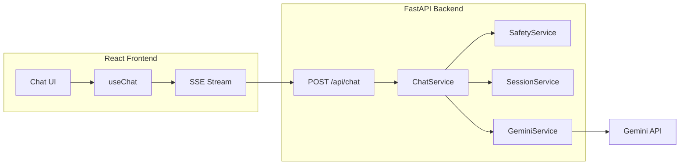

# Askio

**Ask Anything. Every Language. Instant Answers.**

Askio is a multilingual AI conversation platform built for learning and portfolio demonstration. It showcases React architecture, FastAPI backend design, Gemini AI integration, secure API key handling, streaming UX, and production-ready project structure — without login, database, or persistent chat history.

## Features

| Feature | Status |
|---------|--------|
| Real-time SSE streaming responses | Done |
| Multilingual auto-reply (Tamil, Hindi, English, etc.) | Done |
| Markdown + syntax-highlighted code blocks | Done |
| Profanity / safety filter (zero tokens on block) | Done |
| Session memory (in-memory, clears on refresh) | Done |
| Response modes (Simple, Teacher, Programmer, etc.) | Done |
| Settings (theme, temperature, max tokens) | Done |
| Export TXT / Markdown / PDF | Done |
| Voice input (STT) + optional TTS | Done |
| Metrics (latency, tokens, words, language) | Done |
| Deployment configs (Vercel + Render) | Done |

## Architecture



**Flow:** User message → validation → safety check → session history (last 6 turns) → compact system prompt → Gemini stream → SSE → markdown render.

## Tech Stack

| Layer | Technologies |
|-------|-------------|
| Frontend | React 19, Vite, Tailwind CSS, Axios, React Markdown, Syntax Highlighter |
| Backend | FastAPI, Pydantic, Uvicorn, google-genai, better-profanity |
| AI | Google Gemini 2.0 Flash (free tier) |

## Project Structure

```
Askio/
├── flows.md              # Start here — end-to-end flow docs
├── backend/              # 5 Python files (see backend/README.md)
└── frontend/src/         # 6 JS files (see frontend/README.md)
```

See **[flows.md](flows.md)** for complete frontend → backend flow documentation.

## Installation

### Prerequisites

- Node.js 18+
- Python 3.11+
- Gemini API key from [Google AI Studio](https://aistudio.google.com/apikey)

### Backend

```bash
cd backend
python -m venv venv
source venv/bin/activate   # Windows: venv\Scripts\activate
pip install -r requirements.txt
cp .env.example .env
# Edit .env and set GEMINI_API_KEY
uvicorn main:app --reload
```

API runs at `http://localhost:8000` — Swagger docs at `/docs`.

### Frontend

```bash
cd frontend
npm install
cp .env.example .env
npm run dev
```

App runs at `http://localhost:5173` with `/api` proxied to the backend.

## Environment Variables

### Backend (`backend/.env`)

| Variable | Description | Default |
|----------|-------------|---------|
| `GEMINI_API_KEY` | Google Gemini API key | required |
| `GEMINI_MODEL` | Model name | `gemini-2.0-flash` |
| `CORS_ORIGINS` | Allowed frontend origins | `http://localhost:5173` |
| `MAX_PROMPT_CHARS` | Max user message length | `4000` |
| `MAX_HISTORY_TURNS` | Conversation turns kept | `6` |
| `REQUEST_TIMEOUT_SEC` | Request timeout | `60` |

### Frontend (`frontend/.env`)

| Variable | Description | Default |
|----------|-------------|---------|
| `VITE_API_BASE_URL` | Backend URL (empty = use Vite proxy) | `http://localhost:8000` |

## Token Efficiency

Askio is designed for Gemini free tier limits:

- Single compact system prompt (~80 tokens)
- Mode suffixes add 1 short line each (not full prompt rewrites)
- Only last 6 conversation turns sent to the model
- Safety filter runs locally before any API call
- Output capped via `max_tokens` setting (default 512)
- Token counts estimated locally (`len/4`) — no extra API calls

## Deployment

- **Frontend:** Deploy `frontend/` to Vercel or Netlify. Update `vercel.json` with your backend URL.
- **Backend:** Deploy `backend/` to Render or Railway using `render.yaml` as reference. Set `GEMINI_API_KEY` and `CORS_ORIGINS` in the platform dashboard.

## Future Roadmap

- [ ] Share responses via WhatsApp / email
- [ ] Attachment upload support
- [ ] User authentication and persistent history
- [ ] Multi-provider AI support (OpenAI, Anthropic)

## License

MIT — built for learning and portfolio use.
