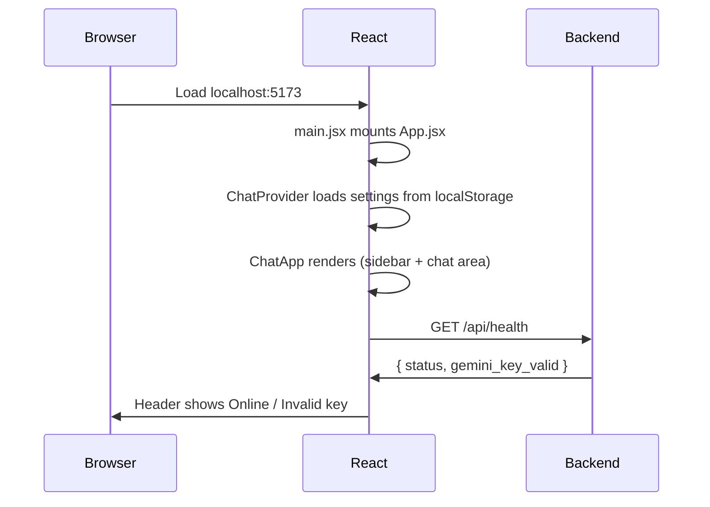
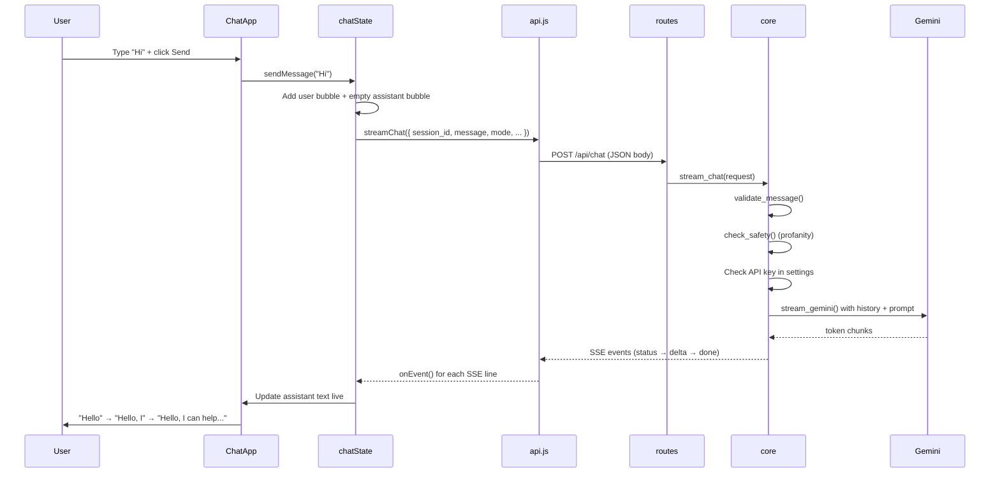
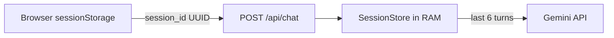

# Askio — End-to-End Flows

How data moves from the browser to Gemini and back.

---

## Project Structure (compact)

```
Askio/
├── flows.md                 ← you are here
├── backend/
│   ├── main.py              # FastAPI app + CORS
│   ├── routes.py            # GET /health, POST /chat
│   ├── core.py              # validate → safety → session → Gemini → SSE
│   ├── schemas.py           # request/response models
│   ├── prompts.py           # system prompt + mode suffixes
│   ├── settings.py          # reads .env
│   └── .env                 # GEMINI_API_KEY (secret)
└── frontend/src/
    ├── main.jsx             # React entry
    ├── App.jsx              # wraps ChatProvider
    ├── ChatApp.jsx          # entire UI (sidebar, chat, input, settings)
    ├── chatState.jsx        # messages, settings, send/stream logic
    ├── api.js               # fetch health + SSE stream
    └── utils.js             # constants, session ID, export
```

**6 frontend files. 5 backend files.** That's it.

---

## Flow 1 — App Startup



| Step | File | What happens |
|------|------|--------------|
| 1 | `main.jsx` | Mounts React app |
| 2 | `App.jsx` | Applies dark/light theme from localStorage |
| 3 | `chatState.jsx` | `ChatProvider` initializes empty messages + settings |
| 4 | `ChatApp.jsx` → `Header` | Calls `checkHealth()` from `api.js` |
| 5 | `routes.py` | Returns API key status (never exposes the key) |

---

## Flow 2 — User Sends a Message



### Step-by-step

#### Frontend

| # | File | Action |
|---|------|--------|
| 1 | `ChatApp.jsx` → `InputBar` | User submits form |
| 2 | `chatState.jsx` → `sendMessage()` | Validates length, creates 2 message objects |
| 3 | `chatState.jsx` | Gets `session_id` from `sessionStorage` (via `utils.js`) |
| 4 | `api.js` → `streamChat()` | `fetch POST /api/chat` with JSON body |
| 5 | `api.js` | Reads response body as stream, parses `data: {...}\n` SSE lines |
| 6 | `chatState.jsx` | On `delta` event: append text to assistant message |
| 7 | `ChatApp.jsx` → `Message` | Shows growing text + blinking cursor while streaming |
| 8 | `chatState.jsx` | On `done` event: saves metrics (latency, tokens) |

#### Backend

| # | File | Action |
|---|------|--------|
| 1 | `routes.py` | Receives `ChatRequest`, returns `StreamingResponse` |
| 2 | `core.py` → `validate_message()` | Empty check, max length, no HTML/scripts |
| 3 | `core.py` → `check_safety()` | Profanity filter (zero Gemini tokens if blocked) |
| 4 | `core.py` | Checks `GEMINI_API_KEY` from `settings.py` |
| 5 | `core.py` | Loads last 6 turns from `SessionStore` (in-memory RAM) |
| 6 | `prompts.py` | Builds compact system prompt + mode suffix |
| 7 | `core.py` → `stream_gemini()` | Calls Gemini API (only place that talks to AI) |
| 8 | `core.py` | Yields SSE events: `status` → `delta` → `done` |

---

## Flow 3 — SSE Event Types

Each line from the backend looks like:

```
data: {"type":"status","text":"Thinking..."}

data: {"type":"delta","text":"Hello"}

data: {"type":"delta","text":", I can"}

data: {"type":"done","metrics":{"latency_ms":1200,"tokens_est":45,...}}
```

| Event | When | Frontend action |
|-------|------|-----------------|
| `status` | Before/during AI call | Show "Understanding… / Thinking… / Writing…" |
| `delta` | Each token from Gemini | Append text to assistant bubble (live stream) |
| `done` | Stream finished | Show metrics bar, switch to markdown render |
| `error` | Validation/safety/API fail | Show red error banner |

---

## Flow 4 — Session Memory



| What | Where | Lifetime |
|------|-------|----------|
| `session_id` | Browser `sessionStorage` | Until tab closed |
| Chat history | Backend `SessionStore` (dict in RAM) | Until server restart |
| Settings (mode, theme) | Browser `localStorage` | Permanent |

**Refresh page** → new session_id → memory cleared (by design, no database).

---

## Flow 5 — New Chat / Clear

```
User clicks "New Chat" or "Clear Chat"
  → chatState.jsx → clearChat()
  → Abort any in-flight stream
  → Clear messages array
  → resetSessionId() in utils.js (new UUID)
  → Backend gets new session_id → empty history
```

---

## Flow 6 — Settings Change

```
User opens Settings panel in ChatApp.jsx
  → Changes mode (simple/teacher/programmer...) or temperature
  → chatState.jsx → setSettings()
  → Saved to localStorage via utils.js
  → Next message sends new mode in POST body
  → prompts.py appends different suffix to system prompt
```

---

## Flow 7 — Export Chat

```
User clicks "Download TXT" or "Download MD"
  → ChatApp.jsx → Sidebar button
  → utils.js → downloadChat(messages, type)
  → Creates blob → browser download
  (No backend call — export is client-side only)
```

---

## Flow 8 — Error Paths

| Error | Where caught | User sees |
|-------|-------------|-----------|
| Empty message | `core.py` validate | SSE error event |
| Profanity | `core.py` safety | "violates safety policy" |
| Missing API key | `core.py` | "Set GEMINI_API_KEY in .env" |
| Invalid API key | `core.py` or Gemini | "Invalid Gemini API key" |
| Rate limit | Gemini → `friendly_error()` | "Rate limit exceeded" |
| Network fail | `api.js` fetch catch | Error banner in UI |

---

## Quick Reference — Which File Does What?

| I want to… | Edit this file |
|------------|----------------|
| Change UI layout/colors | `frontend/src/ChatApp.jsx` |
| Change chat logic (send, stream) | `frontend/src/chatState.jsx` |
| Change API URL / SSE parsing | `frontend/src/api.js` |
| Change API key / model | `backend/.env` |
| Change AI prompt / modes | `backend/prompts.py` |
| Change validation / safety / Gemini call | `backend/core.py` |
| Add new API endpoint | `backend/routes.py` |

---

## Run Commands

```bash
# Terminal 1 — Backend
cd backend && ./venv/bin/uvicorn main:app --reload

# Terminal 2 — Frontend
cd frontend && npm run dev

# Verify API key
cd backend && ./venv/bin/python scripts/check_gemini_key.py
```

Open `http://localhost:5173` → type a question → watch text stream live.
